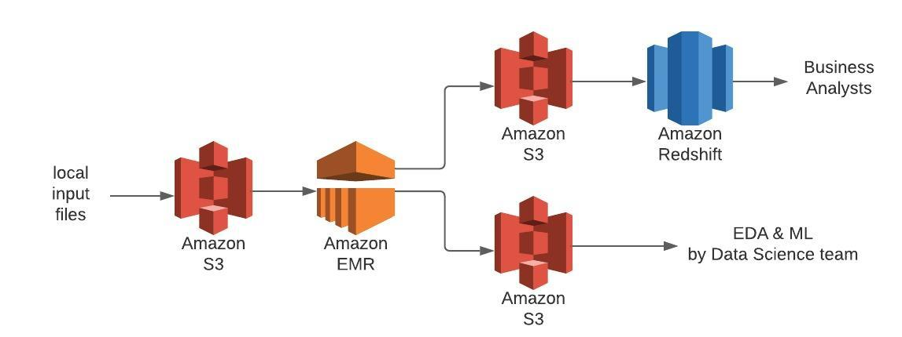
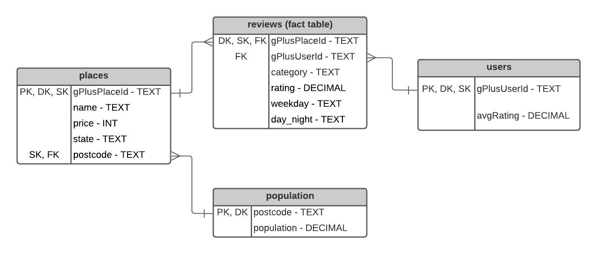

# Data Engineering Capstone Project

## Project Summary

The goal of this project was to create an ETL data pipeline to clean, process and enrich data from Google Local reviews 
of US-based businesses on Google Local and make it available for analysis by two different teams:
- a team of data scientists working on a Machine Learning model to cover a wide range of business categories.
- a team of data analysts that will perform an exploratory analysis of restaurant reviews for a business client who 
  owns a US-based Italian restaurant chain.

## Prerequisites

- AWS key & secret 
  
- AWS EC2 key pair (.pem file)

- S3 Bucket

## Data & Code

3 input files are used for this project:
- **places.json** and **reviews.json** - please download from https://cseweb.ucsd.edu/~jmcauley/datasets.
html#google_local

- **us_population_by_zip_code.csv** - included in this project folder (obtained from https://blog.splitwise.
com/2013/09/18/the-2010-us-census-population-by-zip-code-totally-free/)

Code:
- **main-pipeline.py** - main script to execute the full data pipeline using Spark then AWS Redshift.
- **launch_redshift_cluster.py** - script called from the main pipeline script to create and launch a Redshift cluster 
  in order to create a database in Redshift. Includes the creation of an IAM Role with necessary policy attached to .
- **sql_queries.py** - contains all the SQL queries needed to create the tables & perform a data quality check
- **credentials.cfg** - contains all the parameters needed for the execution of the pipeline script, including AWS 
  credentials

**The script is designed to run on an AWS EMR instance. To execute the pipeline:**

1. Upload the 3 input files to your AWS S3 bucket, ensuring they are named: places.json, 
   reviews.json and us_population_by_zipcode.csv
   

2. Update `credentials.cfg` with your S3 bucket name and Amazon access key & secret

3. Launch an EMR instance from your command line:
`aws emr create-cluster --name capstone-emr --use-default-roles --release-label emr-5.30.0 --applications Name=Spark --ec2-attributes KeyName=spark-cluster --instance-type m3.xlarge --instance-count 3
`
 
  
4. Wait until the instance is up and running, then ssh into it via the command line, replacing xxx with your 
   instance address:
   `ssh -i /Users/apple/Documents/spark-cluster.pem hadoop@xxx-x-xxx-xx-xxx.xxx.compute.amazonaws.com
`

5. Install the required packages on the EMR instance:
    `sudo pip-3.7 install boto3 psycopg2-binary
`

6. From your local machine, copy the project code over to your EMR instance from its current local 
   location:
   `scp -i /path/to/your/keyname.pem -r /path/to/local/project/folder 
   hadoop@xxx.xxx.compute.amazonaws.com:/home/hadoop/
`
   

7. To monitor the spark jobs via the SparkUI, you can open an ssh tunnel using:
`ssh -i  /path/to/your/keyname.pem -N -D 8157 hadoop@xxx.xxx.compute.amazonaws.com
`
   

8. From your EMR instance CLI, execute the pipeline:
`spark-submit main-pipeline.py
`
   
## Project details

### Data Pipeline Architecture

The first step in the project was to define a high level view of the data pipeline and decide on the most appropriate  
tools & technologies. As the main dataset contains over 10 million rows, Apache Spark was used to speed up the 
initial assessment of the data performed via a Jupyter notebook, as well as the ETL pipeline. To make full use of 
Spark's parallel processing capability, the pipeline is executed on an AWS EMR cluster running 3 instances. 

To store the large dataset for the team of Data Scientists, I opted for a Data Lake on S3 using parquet format files,
as this storage type is much cheaper than a data warehouse but still fast to query and compatible with Python tools 
to perform exploratory analyses and ML model development. This low-cost storage option meant we could keep the full 
text of the reviews for a potential NLP analysis as well.

As business analysts have a different set of technical skills from the Data Scientists and primarily use SQL 
directly to query their data, I opted to create a smaller Data Warehouse using a Redshift database, containing only the 
data pertinent to their case study in order to minimise the cost (i.e. excluding the full review text, and 
including only categories relating restaurants, though the category is parameterised, should another project arise in 
the future that requires data for a different business category). A temporary data lake was created first on S3 as a 
staging dataset before loading the data into a Redshift database.

Below is a diagram of the data pipeline's high level architecture

### Data processing steps

An initial analysis of the data was performed to assess data quality and identify opportunity for feature 
engineering to enrich the dataset. As a result of the analysis, the following steps were included in the data pipeline:
- reformat the json files so they can be read as json by pySpark without corruption errors caused by formatting issues.
- remove non USA-based reviews (country derived from postcode)
- enrich with local population data
- drop irrelevant features such as GPS coordinates and phone numbers
- drop rare categories where not enough reviews were available for a meaningful analysis

Some extra features were engineered as they could be a factor in the rating given by a user. e.g. the day of the week,
  whether the review was written during the day or at night (which could influence the mood of the user at the
  time of writing), and the average rating given by each unique user.
  
The datasets were then combined into a large Data Lake containing all the reviews for US-based businesses, partitioned 
by business category. This column was chosen for partitioning as it's a likely candidate for aggregation in an ML model 
i.e. it is likely that a different model would be developed for each category, or group of categories.

#### Reviews Data Lake - data model

**category** - business category (e.g. Restaurant, Café, Museum...) - partitioning column 
**gPlusPlaceId** - unique identifier for each Google Local business 
**day_night** - two possible values: "day" or "night", whether the review was submitted 8am-6pm or 6pm-8am 
**gPlusUserId** - unique identifier for each Google Local user 
**rating** - the rating assigned by the user for the review representing a number of stars 0-5 
**reviewTime** - timestamp indicating when the review was submitted 
**reviewText** - full text review written by the user 
**userAvgRating** - average rating given by the reviewer (across all their other reviews) 
**weekday** - day of the week that the review was submitted 
**address** - address of the business 
**country** - country of the business (USA only here) 
**name** - name of the business 
**population** - number of people living in the business locality (at postcode level) 
**postcode** - postcode of the business 
**price** - 0-5 rating of the price level of the business (not assigned by user, this is unique per business) 
**state** - US state the business is located in (extracted from address) 

In parallel to the Data Lake above, a temporary staging data lake was created without column partitioning. This 
was a necessary step as the COPY command to load the data into a Redshift Data Warehouse cannot otherwise include the 
partitioning column when reading from parquet files. Although this sadly meant an additional step in the pipeline,
it was very fast and did not adversely impact the total processing time.

#### Amazon Redshift Data Warehouse data model

The data model for the Data warehouse is based on the STAR model. This format was selected as it is very clear and 
easily understandable and usable by the business analysts. The DW contains one fact table with the reviews data and 
three dimension tables containing details about places (businesses), users and population.

Each row in the database is a review left by a user for a business in a category. If a business fits several 
categories, there is a record per category i.e. the same review is duplicated for each category representing the 
business, to allow aggregation at the category level.

NB: If there was a unique category per business, the category related to each business in the review would normally be 
more logically included on the `places` dimension table. However, as places can be represented by a number of categories
(e.g. both Restaurant, Italian Restaurant and International Restaurant), I wanted to allow the business analyst to query
by category to enable a more granular analysis. Having several records for the same place on the places table would 
have broken the referential integrity of the gPlusPlaceId foreign key between the reviews table and the places table.

In order to optimise query efficiency on the Redshift DW, I indicated Distribution Keys as well as Sort Keys in the 
schema. 
- The `reviews` table is distributed and sorted by gPlusPlaceId, to allow for efficient joining with the `places` 
  table.
- The `places` table is distributed by gPlusPlaceId to allow efficient joining with the `reviews` table.
- The `users` table is distributed and sorted by gPlusUserId as this is the primary key and the foreign key 
  referenced by the `reviews` table.
- The `population` table is distributed by postcode, to allow efficient joining with the `places` table.

#### Project Data Dictionary

| Field Name | Data Type | Description | Example |
| :--------- | :-------- | :---------- | :------ |
| gPlusPlaceId | String | Unique identifier for each Google Local business | "103054478949000078829" |
| gPlusUserId | String | Unique identifier for Google Local user/reviewer | "100004578649040078529" |
| category | String | Business category of the business being reviewed | "Restaurant", "Museum", ... |
| rating | Decimal | Rating assigned by the user for the review representing a number of stars 0-5 | 5.0 |
| price | Integer | Indicates the general price level of the business
| reviewTime | Timestamp | Indicates when the review was submitted by the user (day and time) | '2011-01-07T18:18:39.000Z' |
| reviewText | String | Freeform text review of the business | "Excellent service and delicious food" |
| weekday | String | Day of the week the review was submitted | "Fri" |
| day_night | String | Flag indicating the part of the day the review was submitted. two possible values: "day" or "night", whether the review was submitted 8am-6pm or 6pm-8am | "day", "night" |
| userAvgRating | Decimal | Average rating assigned by the user across all their reviews | 4.3 |
| name | String | Name of the business reviewed | "The Olive Garden" |
| address | String | Address of the business reviewed | "1024 Santa Clara Drive, CA 90210" |
| country | String | Country where the business is located | "USA" |
| state | String | Two-letter code indicating the state where the business is located | "CA" |
| postcode | String | 5-digit zipcode where business is located | "90210" |
| population | Decimal | Population (no. of people) of postcode area | 12000.0 |

### Adapting the pipeline design to different scenarios

#### If the data was increased by 100x

The current pipeline is executed using on EMR with Spark clusters. If the data was increased 100-fold, this 
technology would still be suitable but we would need to increase the number of instances to increase the amount 
of data that can be processed in parallel. We could also increase the performance of the cluster by using higher 
spec nodes.

S3 parquet files would still be a suitable storage option, however the Redshift Data Warehouse may become too costly 
to run on a permanent basis. The load job between S3 and Redshift could be separated from the main pipeline and run 
on an ad-hoc basis only when the business analysts intend to use the database.

#### The pipeline would be run on a daily basis by 7am every day

The current project is a once-off pipeline using historical data. However, if we were to collect the same data daily 
from a Google API, the same pipeline could be used with slight modifications (to append to the data lake & data 
warehouse instead of replacing the data with each job) and scheduled & monitored using Airflow.

#### The database needed to be accessed by 100+ people

This would be a problem if all these users needed Write access as it could affect data integrity. If absolutely 
necessary, Write access could be given to a small number of select users via IAM roles and policies, and the remaining 
users would be assigned IAM roles with Read Only access.

If different sets of users were interested in different sets of data (e.g. different categories), we could create a 
larger Data Warehouse containing several groups of categories, and create different views of the data for different 
users.